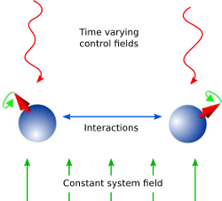
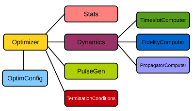

---
jupyter:
  jupytext:
    text_representation:
      extension: .md
      format_name: markdown
      format_version: '1.3'
      jupytext_version: 1.16.7
  kernelspec:
    display_name: Python 3
    language: python
    name: python3
---

<!-- markdown-link-check-disable -->

# QuTiP 概览 - 最优控制


Alexander Pitchford (alex.pitchford@gmail.com),
Jonathan Zoller (jonathan.zoller@uni-ulm.de)


# 引言
在量子控制中，我们希望实现以下目标之一：
制备特定量子态、完成态到态转移，或在量子系统上实现某个变换（量子门）。

对任意给定量子系统，总会存在不可控但影响动力学的因素，
例如系统内部耦合、用于俘获系统的背景磁场等。
与此同时，也常有可控通道可用于调节动力学，
例如激光电场分量随时间变化的幅度。

因此自然会提出两个核心问题：
给定一个具有已知时间无关动力学生成元（*drift*）以及一组外部可控场
（其作用由 *control* 生成元描述）的量子系统：
1. 我们能实现哪些态或变换（若可实现）？
2. 达成目标所需控制脉冲形状是什么？

这两个问题分别对应*可控性*与*量子最优控制* [1]。
其中可控性由动力学生成元的可交换结构决定，
可形式化为 *Lie Algebra Rank Criterion*（详见 [1]）。
第二个问题通常通过最优控制算法（脉冲优化）来求解。



量子控制应用广泛，包括 NMR、量子计量、化学反应控制、量子信息处理等。

为解释这些算法背后的物理思想，下文先聚焦有限维、封闭量子系统。


# 封闭量子系统
在封闭系统中，量子态可由 ket 表示，态变换是幺正算符，
动力学生成元是哈密顿量。
系统总哈密顿量写为

$ H(t) = H_0 + \sum_{j=1} u_j(t) H_j $

其中 $H_0$ 为漂移哈密顿量，$H_j$ 为控制哈密顿量，
$u_j(t)$ 为相应控制通道的时间变化幅度。

系统动力学由薛定谔方程给出：

$\newcommand{\ket}[1]{\left|{#1}\right\rangle} \tfrac{d}{dt}\ket{\psi} = -i H(t)\ket{\psi} $

全文采用单位制 $\hbar=1$。
其解可写为

$\ket{\psi(t)} = U(t)\ket{\psi_0}$

其中 $U(t)$ 满足算符形式薛定谔方程

$\tfrac{d}{dt}U = -i H(t)U ,\quad U(0) = \mathbb{1}$

最优控制的目标可包括：
- 从 $\ket{\psi_0}$ 演化到 $\ket{\psi_1}$（态到态转移）；
- 从任意初态驱动到指定态（态制备）；
- 实现目标幺正变换 $U_{target}$（门综合）。

在量子计算中，门综合通常最关键。


# GRAPE 算法
GRAPE（GRadient Ascent Pulse Engineering）最早由 [2] 提出。
一般而言，时间依赖哈密顿量的薛定谔方程难以解析求解，
因此常采用分段常数近似：
将总演化时间 $T$ 划分为 $M$ 个时间片，
每片内控制幅值视为常数。

于是哈密顿量近似为

$H(t) \approx H(t_k) = H_0 + \sum_{j=1}^N u_{jk} H_j\quad$

其中 $k$ 为时间片索引，$j$ 为控制索引，$N$ 为控制通道数。
时间片传播子为

$X_k:=e^{-iH(t_k)\Delta t_k}$

累计演化可写为

$X(t_k):=X_k X_{k-1}\cdots X_1 X_0$

若目标为态转移，则 $X_0=\ket{\psi_0}$、目标 $X_{targ}=\ket{\psi_1}$；
若目标为门综合，则 $X_0=\mathbb{1}$、$X_{targ}=U_{targ}$。

优化目标通常通过*保真度*（或等价的*失真度/不保真度*）度量。
幺正系统中常用指标为

$\newcommand{\tr}[0]{\operatorname{tr}} f_{PSU} = \tfrac{1}{d} \big| \tr \{X_{targ}^{\dagger} X(T)\} \big|$

其中 $d$ 为系统维度。
取绝对值可忽略全局相位差，且 $0\le f\le1$。
通常更常优化 $\varepsilon = 1-f_{PSU}$。

离散化后有 $N\times M$ 个变量（$u_{jk}$）和一个标量目标 $\varepsilon$，
问题转化为有限维多变量优化。
基础思路是“爬山法”（一阶梯度法），
但容易陷入局部极值。
量子最优控制中，若系统完全可控，理论下界通常为 $\varepsilon=0$；
否则很难判断当前最小值是否已是全局最优。

二阶信息（Hessian）可显著提升收敛效率。
显式使用 Hessian 的方法是 Newton-Raphson；
但 Hessian 计算代价高，因此常用拟牛顿法（quasi-Newton）。
在量子最优控制中常见 BFGS；
QuTiP Qtrl 的 GRAPE 默认通常使用 Scipy 的 L-BFGS-B [3]，
其优点是内存需求低且可加变量边界（控制幅值边界通常有物理意义）。

若可解析计算梯度，优化效率通常远高于数值近似梯度。
对于如 $f_{PSU}$ 这类目标，梯度可解析获得。
封闭幺正系统常用本征分解法；
更一般情形（如开放系统、辛动力学）可用 Fréchet 导数（增广矩阵）法 [4]。
若目标函数难以解析求导，则需数值近似梯度，
这会明显增加开销，且在某些任务上 GRAPE 可能不再占优。

QuTiP 中基于二阶梯度上升的 GRAPE 示例：
- [pulseoptim Hadamard](./02-cpo-GRAPE-Hadamard.ipynb)
- [pulseoptim QFT](./03-cpo-GRAPE-QFT.ipynb)
- 开放系统：[pulseoptim - Lindbladian](./04-cpo-GRAPE-QFT.ipynb)
- 辛动力学：[pulseoptim - symplectic](./05-cpo-cpo-symplectic.ipynb)


# CRAB 算法
已有研究表明 [5]：在有限控制精度与有限演化时间下，
量子最优控制问题的有效维度与可达态流形维度呈多项式关系。
直观上可理解为：脉冲信息复杂度往往不高，
很多时候可被少量参数很好表征。

CRAB（Chopped RAndom Basis）算法 [6,7] 的核心思想是：
用物理启发的基函数展开脉冲，将高维时间片优化问题
转化为低维参数搜索问题。
与精确数值演化所需时间片数相比，
CRAB 的优化维度通常可低若干数量级，
因此适合在现实实验约束下优化平滑脉冲。

CRAB 本身不强制基函数形式，
需要结合系统先验（对称性、尺度、可实现频段等）和目标解特征
（符号、平滑性、bang-bang 行为、奇异点、最大幅值与变化率等）谨慎选择。
它可自然融入实验约束：最大频率、最大幅值、平滑启停等。
若已有较好初猜，也可用于加速收敛。

和 GRAPE 一样，CRAB 也可能陷入局部极小。
为此提出了“dressed CRAB”变体 [8]，可提升跳出局部极小的能力。

对于某些控制目标或动力学模型，
目标函数对每个时间片的梯度难以推导或计算代价高；
伴随态反向传播也可能昂贵。
CRAB 不依赖这些结构，而是将时间演化视作黑盒：
输入脉冲，返回代价（如不保真度）。
这使其特别适合闭环实验：
可将开环优化、实验修正（模型误差、系统噪声）在同一框架下完成。

QuTiP 中 CRAB 示例：
- [State-to-state 2 Qubit (CRAB)](./06-CRAB-2qubit-state_to_state.ipynb)
- [QFT (CRAB)](./07-cpo-CRAB-QFT.ipynb)


# QuTiP 最优控制实现
QuTiP 目前有两套最优控制实现。
第一套是一阶 GRAPE 实现（此处不展开，示例见上文）。
第二套通常称为 Qtrl（其集成进 QuTiP 前的名称）。

Qtrl 使用 Scipy optimize 执行多变量优化：
GRAPE 常用 L-BFGS-B，CRAB 常用 Nelder-Mead。
Qtrl 的 GRAPE 最初基于 MATLAB 开源包 DYNAMO [9]，
随后为适配 QuTiP 做了重构与扩展。
未来计划包括两套 GRAPE 实现合并，以及引入 dressed CRAB。

本节后续说明 Qtrl 的对象模型与使用方式。

## 对象模型
Qtrl 采用分层对象模型，
目标是在保持结构清晰的同时提高可配置性。
使用 pulseoptim 接口并不要求完全理解该模型，
但若需高级定制，这是最灵活的方法。
若仅需一键接口（示例 notebook 常见），
可直接跳到“Using the pulseoptim functions”。



各对象详细属性/方法见官方文档，下面仅给职责概览。

### OptimConfig
保存全局配置：各对象子类类型、用户特定参数等。
也可通过 loadparams 模块从配置文件读入参数。

### Optimizer
对 Scipy.optimize 的封装，执行脉冲优化算法。
可指定优化方法；
提供 BFGS、L-BFGS-B 与 CRAB 的对应子类。

### Dynamics
管理每个时间片的动力学生成元、传播子与时间演化算符列表，
并负责生成元合并。
支持多种系统：封闭幺正系统、二次哈密顿量高斯/辛系统、
以及开放系统（Lindblad）的一般子类。

### PulseGen
包含多种初始脉冲生成器子类。
由于并非所有初始条件都能收敛到目标，
常用随机初始脉冲并重复优化，直到达到目标不保真度或给出最佳结果。
CRAB 还包含专用子类，根据待优化基函数系数生成脉冲。

### TerminationConditions
集中定义单次优化终止条件：
如最大迭代次数、最大运行时间、目标不保真度阈值等。

### Stats
可选地收集优化过程性能数据，
统一存储、计算并汇报运行统计。

### FidelityComputer
该对象子类决定保真度度量类型，
并与所选动力学模型紧密相关。
它也是用户最常定制的部分之一。

### PropagatorComputer
负责从一个时间片到下一时间片的传播子及其梯度计算。
可选策略包括谱分解法与 Fréchet 导数法。

### TimeslotComputer
通过调用其他“computer”对象的方法，完成时间演化计算。

### OptimResult
单次脉冲优化返回结果对象，
包含最终不保真度、终止原因、性能统计、最终演化等信息。

## 使用 pulseoptim 函数
最简单的方式是直接调用 pulseoptim 模块函数。
该接口会自动完成：
创建并配置对象、生成初始脉冲、执行优化并返回结果。

其中有针对幺正动力学和 CRAB 的专用函数；
默认是 GRAPE。
`optimise_pulse` 实际也可覆盖幺正动力学与/或 CRAB 场景，
专用函数主要是参数命名更贴近应用语境。

半自动方式是先调用 `create_optimizer_objects` 生成并配置对象，
再手动设置初始脉冲并执行优化。
当需要多次重复运行（不同初始条件）时，这通常更高效。
示例见 [pulseoptim QFT](./03-cpo-GRAPE-QFT.ipynb)。


<!-- markdown-link-check-enable -->
# 参考文献
1. D. d’Alessandro, *Introduction to Quantum Control and Dynamics* (Chapman & Hall/CRC, 2008)
2. N. Khaneja, T. Reiss, C. Kehlet, T. Schulte-Herbruggen, and S. J. Glaser, J. Magn. Reson. 172, 296 (2005).
3. R. H. Byrd, P. Lu, J. Nocedal, and C. Zhu, SIAM J. Sci. Comput. 16, 1190 (1995).
4. F. F. Floether, P. de Fouquieres, and S. G. Schirmer, New J. Phys. 14, 073023 (2012).
5. S. Lioyd and S. Montangero. Phys. Rev. Lett. 113, 010502 (2014)
6. P. Doria, T. Calarco & S. Montangero. Phys. Rev. Lett. 106, 190501 (2011).
7. T. Caneva, T. Calarco, & S. Montangero. Phys. Rev. A 84, 022326 (2011).
8. N. Rach, M. M. Mueller, T. Calarco, and S. Montangero. Phys. Rev. A. 92, 062343 (2015)
9. S. Machnes, U. Sander, S. J. Glaser, P. De Fouquieres, A. Gruslys, S. Schirmer, and T. Schulte-Herbrueggen, Phys. Rev. A 84, 022305 (2010).

```python

```
