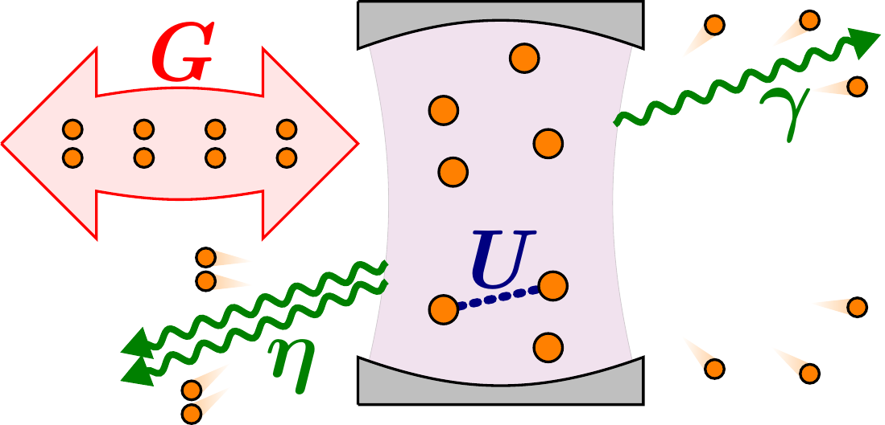
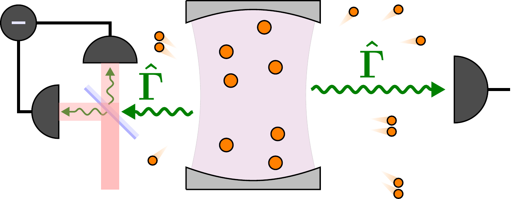

---
jupyter:
  jupytext:
    text_representation:
      extension: .md
      format_name: markdown
      format_version: '1.3'
      jupytext_version: 1.14.5
  kernelspec:
    display_name: Python 3 (ipykernel)
    language: python
    name: python3
---

# 随机薛定谔 vs Monte-Carlo 求解器：猫态变得“相干”

$\newcommand{\ket}[1]{| #1 \rangle}$
$\newcommand{\bra}[1]{\langle #1 |}$
$\newcommand{\braket}[1]{\langle #1 \rangle}$
$\newcommand{\CC}{\mathcal{C}}$
Author: F. Minganti (minganti@riken.jp)

本笔记展示：同一个系统会因观测者采集谐振器输出场方式不同，而呈现极其不同的结果。内容紧随文献 [1-3] 的结果。

```python
import matplotlib.pyplot as plt
import numpy as np
from qutip import (
    about,
    destroy,
    expect,
    fock,
    mcsolve,
    ssesolve,
    steadystate,
    wigner,
)
```

## 双光子 Kerr 谐振器

考虑一个单模非线性 Kerr 谐振器，受到参量双光子驱动。
在泵浦频率旋转系下，哈密顿量为
\begin{equation}\label{Eq:Hamiltonian}
\hat{H}
=\frac{U}{2}\,\hat{a}^\dagger\hat{a}^\dagger\hat{a}\hat{a}
+\frac{G}{2}\left(\hat{a}^\dagger\hat{a}^\dagger+\hat{a}\hat{a}\right),
\end{equation}
其中 $U$ 是 Kerr 光子-光子相互作用强度，$G$ 是双光子驱动幅度，$\hat{a}^\dagger$（$\hat{a}$）是玻色产生（湮灭）算符。



该系统密度矩阵 $\hat{\rho}$ 的时间演化由 Lindblad 主方程给出：$i \partial_t \hat{\rho} = \mathcal{L} \hat{\rho}$，其中 $\mathcal{L}$ 是 Liouvillian 超算符。
$\mathcal{L}$ 包含哈密顿量项和非厄米耗散项，用于描述能量、粒子和信息向环境泄露（细节见例如 [5]）。

在参量驱动下，耗散通道包括单光子与双光子耗散，Lindblad 超算符为
\begin{equation}\label{Eq:Lindblad}
\mathcal{L} \hat{\rho} = - i \left[\hat{H},\hat{\rho}\right]
+\frac{\gamma}{2} \left(2\hat{a}\hat{\rho}\hat{a}^\dagger
-\hat{a}^\dagger\hat{a}\hat{\rho}
-\hat{\rho}\hat{a}^\dagger\hat{a}\right)
+ \, \frac{\eta}{2} \left(2\hat{a}\hat{a}\hat{\rho}\hat{a}^\dagger\hat{a}^\dagger
-\hat{a}^\dagger\hat{a}^\dagger\hat{a}\hat{a}\hat{\rho}
-\hat{\rho}\hat{a}^\dagger\hat{a}^\dagger\hat{a}\hat{a}\right),
\end{equation}
其中 $\gamma$ 与 $\eta$ 分别是单光子与双光子耗散率。

下面定义系统参数。 

```python
font_size = 20
label_size = 30
title_font = 35
```

```python
a = destroy(20)
U = 1
G = 4
gamma = 1
eta = 1
H = U * a.dag() * a.dag() * a * a + G * (a * a + a.dag() * a.dag())
c_ops = [np.sqrt(gamma) * a, np.sqrt(eta) * a * a]

parity = 1.0j * np.pi * a.dag() * a
parity = parity.expm()

rho_ss = steadystate(H, c_ops)
```

该模型稳态可精确求解 [2,3]。
对应稳态密度矩阵 $\hat{\rho}_{\rm ss}$ 可近似为两个正交态的统计混合：
\begin{equation}\label{Eq:MixtureCats}
\hat{\rho}_{\rm ss}\simeq
p^+\,\ket{\CC^+_\alpha}\!\bra{\CC^+_\alpha}
+p^-\,\ket{\CC^-_\alpha}\!\bra{\CC^-_\alpha},
\end{equation}
其中 $\ket{\CC^\pm_\alpha}\propto\ket{\alpha}\pm\ket{-\alpha}$ 是光学薛定谔猫态，复振幅 $\alpha$ 由系统参数决定 [2-4]。
相干态 $\ket{\alpha}$ 满足 $\hat{a} \ket{\alpha}=\alpha \ket{\alpha}$。
$\ket{\CC^+_\alpha}$ 称偶猫态（仅由偶数 Fock 态叠加），$\ket{\CC^-_\alpha}$ 为奇猫态。
上式中系数 $p^\pm$ 可理解为系统位于对应猫态的概率。

下面通过对稳态密度矩阵对角化，并绘制最可能两态的光子数分布来展示这一特征。

```python
vals, vecs = rho_ss.eigenstates(sort="high")
print("The mean number of photon is " + str(expect(a.dag() * a, rho_ss)))

plt.figure(figsize=(8, 6))
plt.semilogy(range(1, 7), vals[0:6], "rx")
plt.xlabel("Eigenvalue", fontsize=label_size)
plt.ylabel("Probability", fontsize=label_size)
plt.title("Distribution of the eigenvalues", fontsize=title_font)
plt.show()
```

```python
state_zero = vecs[0].full()
state_one = vecs[1].full()


plt.figure(figsize=(8, 6))
plt.plot(
    range(0, 20),
    [abs(i) ** 2 for i in state_zero[0:20]],
    "rx",
    label="First state",
)
plt.plot(
    range(0, 20),
    [abs(i) ** 2 for i in state_one[0:20]],
    "bo",
    label="Second state",
)
plt.legend()
plt.xlabel("Fock state", fontsize=label_size)
plt.ylabel("Probability", fontsize=label_size)
plt.show()
```

可见两态具有相反宇称。事实上在强泵浦（$G> U,\gamma,\eta$ 且 $|\alpha|\gg1$）下，文献 [2] 给出 $p^+\simeq p^- \simeq 1/2$。
此时稳态也可改写为
\begin{equation}\label{Eq:MixtureCoherent}
\hat{\rho}_{\rm ss}\simeq
\frac{1}{2}\ket{\alpha}\!\bra{\alpha}
+\frac{1}{2}\ket{-\alpha}\!\bra{-\alpha}.
\end{equation}
因此稳态同样可看作相位相反的两个相干态混合。
既然 $\hat{\rho}_{\rm ss}$ 本质上是两个（近）正交态的混合，它呈现双峰特性。
该双峰可通过 Wigner 函数等方式可视化 [2,3]。
关键问题是：若监测系统演化，实际会观察到哪些态？
是正交猫态、相位相反的两个相干态，还是都不是？
下面将看到，答案强烈依赖具体测量方案。

```python
xvec = np.linspace(-4, 4, 500)
W_even = wigner(vecs[0], xvec, xvec, g=2)
W_odd = wigner(vecs[1], xvec, xvec, g=2)
```

```python
W_ss = wigner(rho_ss, xvec, xvec, g=2)
W_ss = np.around(W_ss, decimals=2)
plt.figure(figsize=(10, 8))

plt.contourf(xvec, xvec, W_ss, cmap="RdBu", levels=np.linspace(-1, 1, 20))
plt.colorbar()
plt.xlabel(r"Re$(\alpha)$", fontsize=label_size)
plt.ylabel(r"Im$(\alpha)$", fontsize=label_size)
plt.title("Steady state", fontsize=title_font)
plt.show()
```

```python
W_even = np.around(W_even, decimals=2)
plt.figure(figsize=(10, 8))
plt.contourf(xvec, xvec, W_even, cmap="RdBu", levels=np.linspace(-1, 1, 20))
plt.colorbar()
plt.xlabel(r"Re$(\alpha)$", fontsize=label_size)
plt.ylabel(r"Im$(\alpha)$", fontsize=label_size)
plt.title("First state: even cat-like", fontsize=title_font)
plt.show()
```

```python
W_odd = np.around(W_odd, decimals=2)
plt.figure(figsize=(10, 8))

plt.contourf(xvec, xvec, W_odd, cmap="RdBu", levels=np.linspace(-1, 1, 20))
plt.colorbar()
plt.xlabel(r"Re$(\alpha)$", fontsize=label_size)
plt.ylabel(r"Im$(\alpha)$", fontsize=label_size)
plt.title("Second state: odd cat-like", fontsize=title_font)
plt.show()
```

## 量子轨迹

从理论上看，Lindblad 主方程描述的是与马尔可夫（无记忆）环境耦合系统的非平衡动力学。
其解 $\hat{\rho}(t)$ 对应“未获取环境信息时”的平均演化。

但可以设想连续探测环境来追踪系统状态。
这样每次实验实现下系统演化都不同；
对无限多次“被监测”实现做平均，才能恢复 $\hat{\rho}(t)$。
Monte Carlo 波函数方法正是基于这一思想：
通过随机过程模拟“持续获取环境信息时”的系统演化。
每次随机演化给出一条量子轨迹；多轨迹平均恢复主方程结果。

要模拟量子轨迹，必须显式建模观测者如何测量环境，因为测量本身会反过来影响系统演化（详见 [5]）。
同一个主方程可对应多种测量方式。
不同测量可能给出看似矛盾的结果与解释；但在多轨迹平均后它们会统一。




$\newcommand{\ket}[1]{| #1 \rangle}$
$\newcommand{\bra}[1]{\langle #1 |}$
$\newcommand{\CC}{\mathcal{C}}$
### 光子计数

观测 Kerr 谐振器与环境交换最直接的方法，是检测每个泄漏光子（包括单光子和双光子事件）。
对应单光子跳跃算符 $\hat{J}_1=\sqrt{\gamma}\, \hat{a}$ 与双光子跳跃算符 $\hat{J}_2=\sqrt{\eta}\, \hat{a}^2$，分别描述理想探测器吸收一个或两个光子（细节见例如 [6]）。

在典型实现（如 [4]）中，单/双光子耗散通道可区分，因此可假设探测器能识别一光子与双光子损失。
光子计数轨迹可用 qutip 的 `mcsolve` 获得。
其特征是：与一光子或双光子探测对应的投影测量会引起突发跳跃。


```python
tlist = np.linspace(0, 20, 2000)

sol_mc = mcsolve(
    H,
    fock(20, 0),
    tlist,
    c_ops,
    [a.dag() * a, (a + a.dag()) / 2, -1.0j * (a - a.dag()) / 2, parity],
    ntraj=1,
)
```

```python
plt.figure(figsize=(18, 8))
plt.subplot(311)
plt.plot(tlist, sol_mc.expect[0])
plt.ylabel(r"$\langle \hat{a}^\dagger \hat{a} \rangle$", fontsize=label_size)
plt.xlim([0, 20])
plt.subplot(312)
plt.plot(tlist, sol_mc.expect[3])
plt.ylabel(r"$\langle \hat{P} \rangle$", fontsize=label_size)
plt.xlim([0, 20])
plt.subplot(313)
plt.plot(tlist, sol_mc.expect[1], label=r"$\langle \hat{x} \rangle$")
plt.plot(tlist, sol_mc.expect[2], label=r"$\langle \hat{p} \rangle$")
plt.xlabel(r"$\gamma t$", fontsize=label_size)
plt.xlim([0, 20])
plt.ylim([-3, 3])
plt.legend()
plt.show()
```

如 [2] 所示，哈密顿量 $\hat{H}$ 与双光子耗散倾向于稳定光学猫态。
另一方面，湮灭算符会在偶猫与奇猫之间切换：$\hat{a}\ket{\CC^\pm_\alpha} \propto \alpha \ket{\CC^\mp_\alpha}$。
因此 $\hat{J}_1$ 以与 $\gamma \braket{\hat{a}^\dagger \hat{a}}$ 成正比的速率引起两猫态之间跳转。
光子计数轨迹很好地捕捉了这幅图像（见上图）。

猫态是宇称算符 $\hat{\mathcal{P}}=e^{i \pi \hat{a}^\dagger \hat{a}}$ 的正交本征态，本征值为 $\pm1$。
可见单条轨迹上，系统会随机地在两猫态间歇切换。
而场正交分量均值
$\hat{x}=\left(\hat{a}^\dagger+\hat{a}\right)/2$ 与
$\hat{p}=i\left(\hat{a}^\dagger-\hat{a}\right)/2$
沿轨迹几乎为零，这符合猫态特征。

因此在光子计数环境下，宇称是揭示双峰行为的合适观测量。
也就是说，可将
$$\hat{\rho}_{\rm ss}\simeq
p^+\,\ket{\CC^+_\alpha}\!\bra{\CC^+_\alpha}
+p^-\,\ket{\CC^-_\alpha}\!\bra{\CC^-_\alpha}$$
解释为稳态下系统处于两种猫态的概率。

上述分析似乎支持：相比相干态图像，猫态图像更“真实”地描述稳态。


### 同相测量（Homodyne）

另一种常见监测方式是同相检测，可直接访问场正交分量 [5-6]。
实现上，将腔输出与参考激光相干场在分束器处混合（这里假设理想透过），
再由理想探测器测量混合场，对应新的跳跃算符。
注意这里是同时测量相干场与腔场。

本例中希望分别探测两类耗散通道。
为区分一光子与双光子损失，可借助作用于腔输出的非线性元件。
在实验实现（如 [4]）中，此非线性元件本就是实现双光子过程的关键。
具体地，一光子损失来自谐振器有限品质因数，可直接把腔输出与本振幅度 $\beta_1$ 的相干束混合探测。
因此一光子同相跳跃算符写为 $\hat{K}_1=\hat{J}_1 +\beta_1 \hat{1}$。

双光子损失则由非线性元件（[4] 中为 Josephson 结）介导：它把频率 $\omega_c$ 的两个腔光子转换为一个频率 $\omega_{nl}$ 光子。
因此非线性元件输出场可由第二个独立本振探测。
整个过程可看作“非线性分束器”将耗散光子对与参考振幅 $\beta_2$ 混合。
相应双光子同相跳跃算符为 $\hat{K}_2=\hat{J}_2 +\beta_2 \hat{1}$。
不失一般性，下文取 $\beta_{1,2}$ 为实数 [6]。

在理想极限 $\beta_{1,2}\to\infty$，系统按同相随机薛定谔方程做扩散演化。
在 qutip 中，可用 `ssesolve` 并设 `method='homodyne'` 模拟该轨迹。

```python
tlist = np.linspace(1000, 1200, 201)

sol_hom = ssesolve(
    H,
    fock(20, 0),
    tlist,
    sc_ops=c_ops,
    e_ops=[a.dag() * a, (a + a.dag()) / 2, -1.0j * (a - a.dag()) / 2, parity],
    ntraj=1,
    options={
        "dt": 0.0005,
        "store_measurement": False,
        "method": "platen",
        "progress_bar": False,
    },
    seeds=5,
)
```

```python
plt.figure(figsize=(18, 8))
plt.subplot(311)
plt.plot(tlist, sol_hom.expect[0])
plt.ylabel(r"$\langle \hat{a}^\dagger \hat{a} \rangle$", fontsize=label_size)
# plt.xlim([0,8000])
plt.subplot(312)
plt.plot(tlist, sol_hom.expect[3])
plt.ylabel(r"$\langle \hat{P} \rangle$", fontsize=label_size)
# plt.xlim([0,8000])
plt.subplot(313)
plt.plot(tlist, sol_hom.expect[1], label=r"$\langle \hat{x} \rangle$")
plt.plot(tlist, sol_hom.expect[2], label=r"$\langle \hat{p} \rangle$")
plt.xlabel(r"$\gamma t$", fontsize=label_size)
# plt.xlim([0,8000])
plt.ylim([-3, 3])
plt.legend()
plt.show()
```

可见在单条同相轨迹上，平均宇称 $\braket{\hat{\mathcal{P}}}$ 围绕 0 波动，并不支持“猫态切换”图像。
这些波动来自同相轨迹的扩散特性，它决定了同相检测下系统波函数的随机演化。

相反，双峰行为在 $\braket{\hat{x}}$ 和 $\braket{\hat{p}}$ 的时间演化中很清晰。
这与
$\hat{\rho}_{\rm ss}\simeq
\frac{1}{2}\ket{\alpha}\!\bra{\alpha}
+\frac{1}{2}\ket{-\alpha}\!\bra{-\alpha}$
一致：稳态下系统在 $\ket{\pm\alpha}$ 两个相干态之间切换。
还应注意：同相轨迹中的相位切换速率远小于光子计数轨迹中的宇称切换速率，
这源于 $\ket{\pm\alpha}$ 的亚稳态特性 [1-4]。


# 统一两种视角

总结来说：单条量子轨迹上的行为强烈依赖测量协议。
对环境做光子计数时，系统在宇称定义的猫态间切换；
而同相检测下，单条轨迹探索的是相干态。

换言之，只有在指定单轨迹测量协议后，
混态表示 $\hat{\rho}_{\rm ss}$ 中各概率项才具有明确物理含义。
但单轨迹层面的分歧在多轨迹平均后会被抹平。

```python
tlist = np.linspace(0, 3, 91)
sol_mc_mean = mcsolve(
    H,
    fock(20, 0),
    tlist,
    c_ops,
    [a.dag() * a, (a + a.dag()) / 2, -1.0j * (a - a.dag()) / 2, parity],
    ntraj=50,
)

options = {
    "dt": 0.0001,
    "store_measurement": False,
    "method": "platen",
    "map": "parallel",
}

sol_hom_mean = ssesolve(
    H,
    fock(20, 0),
    tlist,
    sc_ops=c_ops,
    e_ops=[a.dag() * a, (a + a.dag()) / 2, -1.0j * (a - a.dag()) / 2, parity],
    ntraj=50,
    options=options,
)
```

```python
plt.figure(figsize=(18, 8))
plt.subplot(311)
plt.plot(tlist, sol_mc_mean.expect[0], "r", label="Counting")
plt.plot(tlist, sol_hom_mean.expect[0], "b", label="Homodyne")
plt.ylabel(r"$\langle \hat{a}^\dagger \hat{a} \rangle$", fontsize=label_size)
plt.xlim([0, 3])
plt.legend()
plt.subplot(312)
plt.plot(tlist, sol_mc_mean.expect[3], "r")
plt.plot(tlist, sol_hom_mean.expect[3], "b")
plt.ylabel(r"$\langle \hat{P} \rangle$", fontsize=label_size)
plt.xlim([0, 3])
plt.subplot(313)
plt.plot(tlist, sol_mc_mean.expect[2], "r")
plt.plot(tlist, sol_hom_mean.expect[2], "b")
plt.ylabel(r"$\langle \hat{p} \rangle$", fontsize=label_size)
plt.xlim([0, 3])
plt.ylim([-2, 2])
```

<!-- #region -->
## 参考文献


[1] N. Bartolo, F. Minganti 1 , J. Lolli, and C. Ciuti,
Homodyne versus photon-counting quantum trajectories for dissipative Kerr resonators
with two-photon driving, The European Physical Journal Special Topics 226, 2705 (2017).
The European Physical Journal Special Topics 226, 2705 (2017).

[2] F. Minganti, N. Bartolo, J. Lolli, W. Casteels, and C. Ciuti,
Exact results for Schrodinger cats in driven-dissipative systems and their feedback control, Scientific Reports 6, 26987 (2016).

[3] N. Bartolo, F. Minganti, W. Casteels, and C. Ciuti,
Exact steady state of a Kerr resonator with one- and two-photon driving and dissipation: Controllable Wigner-function multimodality and dissipative phase transitions, Physical Review A 94, 033841 (2016).

[4] Z. Leghtas et al., Confining the state of light to a quantum manifold by
engineered two-photon loss, Science 347, 853 (2015).

[5] S. Haroche and J. M. Raimond, Exploring the Quantum: Atoms, Cavities, and Photons
(Oxford University Press, 2006).

[6] H. Wiseman and G. Milburn, Quantum Measurement and Control (Cambridge University Press, 2010).
<!-- #endregion -->

```python
about()
```
